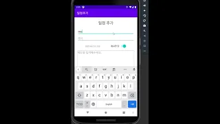
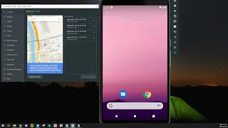
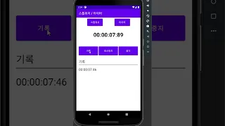

# 안드로이드 일정관리 어플

## 스스로 성장하기 위하여 만든 앱입니다.

### 기능 및 시연영상

#### 회원관리

- 회원가입
  - 아이디 중복확인
  - 비밀번호, 비밀번호 확인
  - 데이터는 쉐어드 프리퍼런스에 저장
- 로그인 및 자동로그인
- 카카오 로그인 (카카오 로그인 API)

#### 일정관리

- 제목, 장소 ,메모 (콘텐츠) 입력
- 날짜, 시간은 다이얼로그로 입력
- 중요한 일 or 아닌지 체크
- 수정 및 삭제
- 오늘자 콘텐츠 확인
- 중요한 콘텐츠 확인
- 브로드캐스트리시버, 서비스를 이용한 날짜와 시간에 맞춰 알림

#### 오늘날씨, 미세먼지, 코로나 현황

- 공공데이터 API를 활용하여 사용자 위치와 시간을 파악하여 데이터 제공 (날씨, 미세먼지, 코로나 현황)

#### 핸들러를 이용한 움직이는 화면 구현

- 로딩창
- 핸들러를 이용한 광고 적용
- 스톱워치
- 타이머

